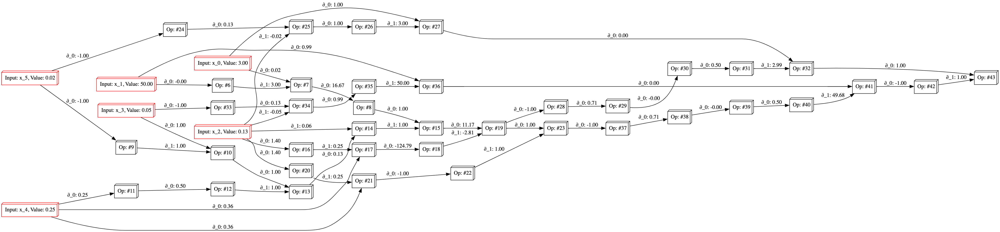

<p align="center">
    <a href="#license" alt="license">
        
    <a href="#version" alt="version">
        
    <a href="#downloads" alt="downloads">
        
    <a href="#stars" alt="stars">
        
</p>

<p align="center">
    <a href="#build" alt="build">
        
    <a href="#codecov" alt="codecov">
        
    <a href="#deps" alt="deps">
        
</p>

<p align="center">
    <a href="#discord" alt="discord">
        
</p>

<!-- <p align="center">
    <a href="#license" alt="license">
        
    <a href="#build" alt="build">
        
    <a href="#downloads" alt="downloads">
        
    <a href="#stars" alt="stars">
        
    <a href="#version" alt="version">
        
    <a href="#codecov" alt="codecov">
        
    <a href="#deps" alt="deps">
        
</p> -->

A Rust library for quantitative finance tools. Also the largest option pricing library in Rust.

:dart: I want to hit a stable `v1.0.0` by the end of 2023, so any feedback, suggestions, or contributions are strongly welcomed!

Email me at: <RustQuantContact@gmail.com>

Join the Discord server: <https://discord.gg/tQcM77h8vr>

## :newspaper: Latest features

See [CHANGELOG.md](./CHANGELOG.md) for a full list of changes.

<details>
<summary>
<h3>:link: Automatic Differentiation <a name="autodiff"></a></h3>
<br>Reverse (Adjoint) Mode Automatic Differentiation.<br>
</summary>

Currently only gradients can be computed. Suggestions on how to extend the functionality to Hessian matrices are definitely welcome.

Additionally, only functions $f: \mathbb{R}^n \rightarrow \mathbb{R}$ (scalar output) are supported. However, you can manually apply the differentiation to multiple functions that could represent a vector output.

- [x] Reverse (Adjoint) Mode
  - Implementation via Operator and Function Overloading.
  - Useful when number of outputs is *smaller* than number of inputs.
    - i.e for functions $f:\mathbb{R}^n \rightarrow \mathbb{R}^m$, where $m \ll n$
- [ ] Forward (Tangent) Mode
  - Implementation via Dual Numbers.
  - Useful when number of outputs is *larger* than number of inputs.
    - i.e. for functions $f:\mathbb{R}^n \rightarrow \mathbb{R}^m$, where $m \gg n$

```rust
use RustQuant::autodiff::*;

fn main() {
    // Create a new Graph to store the computations.
    let g = Graph::new();

    // Assign variables.
    let x = g.var(69.);
    let y = g.var(420.);

    // Define a function.
    let f = {
      let a = x.powi(2);
      let b = y.powi(2);

      a + b + (x * y).exp()
    };

    // Accumulate the gradient.
    let gradient = f.accumulate();

    println!("Function = {}", f);
    println!("Gradient = {:?}", gradient.wrt([x, y]));
}
```

You can also generate Graphviz (dot) code to visualize the computation graphs:

```rust
println!("{}", graphviz(&graph, &variables));
```  

The computation graph from computing Black-Scholes Greeks is:



It is clearly a work in progress, but gives a general idea of how the computation graph is structured.

If you want to improve the visualization, please feel free to submit a PR!

</details>

<details>
<summary>
<h3>:bar_chart: Data <a name="data"></a></h3>
<br>Methods for reading and writing data from/to various sources (CSV, JSON, Parquet). Can also download data from Yahoo! Finance.<br>
</summary>

You can:

- Download data from Yahoo! Finance into a Polars `DataFrame`.
- Compute returns on the `DataFrame` you just downloaded.

```rust
use RustQuant::data::*;
use time::macros::date;

fn main() {
    // New YahooFinanceData instance.
    // By default, date range is: 1970-01-01 to present.
    let mut yfd = YahooFinanceData::new("AAPL".to_string());

    // Can specify custom dates (optional).
    yfd.set_start_date(time::macros::datetime!(2019 - 01 - 01 0:00 UTC));
    yfd.set_end_date(time::macros::datetime!(2020 - 01 - 01 0:00 UTC));

    // Download the historical data.
    yfd.get_price_history();

    // Compute the returns.
    // Specify the type of returns to compute (Simple, Logarithmic, Absolute)
    // You don't need to run .get_price_history() first, .compute_returns()
    // will do it for you if necessary.
    yfd.compute_returns(ReturnsType::Logarithmic);

    println!("Apple's quotes: {:?}", yfd.price_history);
    println!("Apple's returns: {:?}", yfd.returns);
}
```

```bash
Apple's quotes: Some(shape: (252, 7)
┌────────────┬───────────┬───────────┬───────────┬───────────┬────────────┬───────────┐
│ date       ┆ open      ┆ high      ┆ low       ┆ close     ┆ volume     ┆ adjusted  │
│ ---        ┆ ---       ┆ ---       ┆ ---       ┆ ---       ┆ ---        ┆ ---       │
│ date       ┆ f64       ┆ f64       ┆ f64       ┆ f64       ┆ f64        ┆ f64       │
╞════════════╪═══════════╪═══════════╪═══════════╪═══════════╪════════════╪═══════════╡
│ 2019-01-02 ┆ 38.7225   ┆ 39.712502 ┆ 38.557499 ┆ 39.48     ┆ 1.481588e8 ┆ 37.994499 │
│ 2019-01-03 ┆ 35.994999 ┆ 36.43     ┆ 35.5      ┆ 35.547501 ┆ 3.652488e8 ┆ 34.209969 │
│ 2019-01-04 ┆ 36.1325   ┆ 37.137501 ┆ 35.950001 ┆ 37.064999 ┆ 2.344284e8 ┆ 35.670372 │
│ 2019-01-07 ┆ 37.174999 ┆ 37.2075   ┆ 36.474998 ┆ 36.982498 ┆ 2.191112e8 ┆ 35.590965 │
│ …          ┆ …         ┆ …         ┆ …         ┆ …         ┆ …          ┆ …         │
│ 2019-12-26 ┆ 71.205002 ┆ 72.495003 ┆ 71.175003 ┆ 72.477501 ┆ 9.31212e7  ┆ 70.798401 │
│ 2019-12-27 ┆ 72.779999 ┆ 73.4925   ┆ 72.029999 ┆ 72.449997 ┆ 1.46266e8  ┆ 70.771545 │
│ 2019-12-30 ┆ 72.364998 ┆ 73.172501 ┆ 71.305    ┆ 72.879997 ┆ 1.441144e8 ┆ 71.191582 │
│ 2019-12-31 ┆ 72.482498 ┆ 73.419998 ┆ 72.379997 ┆ 73.412498 ┆ 1.008056e8 ┆ 71.711739 │
└────────────┴───────────┴───────────┴───────────┴───────────┴────────────┴───────────┘)
```

```bash
Apple's returns: Some(shape: (252, 7)
┌────────────┬────────────┬───────────────┬───────────────┬───────────────┬──────────────┬──────────────┐
│ date       ┆ volume     ┆ open_logarith ┆ high_logarith ┆ low_logarithm ┆ close_logari ┆ adjusted_log │
│ ---        ┆ ---        ┆ mic           ┆ mic           ┆ ic            ┆ thmic        ┆ arithmic     │
│ date       ┆ f64        ┆ ---           ┆ ---           ┆ ---           ┆ ---          ┆ ---          │
│            ┆            ┆ f64           ┆ f64           ┆ f64           ┆ f64          ┆ f64          │
╞════════════╪════════════╪═══════════════╪═══════════════╪═══════════════╪══════════════╪══════════════╡
│ 2019-01-02 ┆ 1.481588e8 ┆ null          ┆ null          ┆ null          ┆ null         ┆ null         │
│ 2019-01-03 ┆ 3.652488e8 ┆ -0.073041     ┆ -0.086273     ┆ -0.082618     ┆ -0.104924    ┆ -0.104925    │
│ 2019-01-04 ┆ 2.344284e8 ┆ 0.003813      ┆ 0.019235      ┆ 0.012596      ┆ 0.041803     ┆ 0.041803     │
│ 2019-01-07 ┆ 2.191112e8 ┆ 0.028444      ┆ 0.001883      ┆ 0.014498      ┆ -0.002228    ┆ -0.002229    │
│ …          ┆ …          ┆ …             ┆ …             ┆ …             ┆ …            ┆ …            │
│ 2019-12-26 ┆ 9.31212e7  ┆ 0.000457      ┆ 0.017709      ┆ 0.006272      ┆ 0.019646     ┆ 0.019646     │
│ 2019-12-27 ┆ 1.46266e8  ┆ 0.021878      ┆ 0.013666      ┆ 0.011941      ┆ -0.00038     ┆ -0.00038     │
│ 2019-12-30 ┆ 1.441144e8 ┆ -0.005718     ┆ -0.004364     ┆ -0.010116     ┆ 0.005918     ┆ 0.005918     │
│ 2019-12-31 ┆ 1.008056e8 ┆ 0.001622      ┆ 0.003377      ┆ 0.014964      ┆ 0.00728      ┆ 0.00728      │
└────────────┴────────────┴───────────────┴───────────────┴───────────────┴──────────────┴──────────────┘)
```

### Read/write data

```rust
use RustQuant::data::*;

fn main() {
    // New `Data` instance.
    let mut data = Data::new(
        format: DataFormat::CSV, // Can also be JSON or PARQUET.
        path: String::from("./file/path/read.csv")
    )

    // Read from the given file. 
    data.read().unwrap();

    // New path to write the data to. 
    data.path = String::from("./file/path/write.csv")
    data.write().unwrap();

    println!("{:?}", data.data)
}
```

</details>

<details>
<summary>
<h3>:bar_chart: Distributions <a name="distributions"></a></h3>
<br>PDFs, CDFs, MGFs, CFs, and other ditrubution related functions for common distributions.<br>
</summary>

Probability density/mass functions, distribution functions, characteristic functions, etc.

- [x] Gaussian
- [x] Bernoulli
- [x] Binomial
- [x] Poisson
- [x] Uniform (discrete & continuous)
- [x] Chi-Squared
- [x] Gamma
- [x] Exponential

</details>

<details>
<summary>
<h3> :chart_with_upwards_trend: Instruments <a name="instruments"></a></h3>
<br>Various implementations for instruments like `Bonds` and `Options`, and the pricing of them. Others coming in the future (swaps, futures, CDSs, etc).<br>
</summary>

### :chart_with_downwards_trend: Bonds <a name="bonds"></a>

- Prices:
  - [x] The Vasicek Model
  - [x] The Cox, Ingersoll, and Ross Model
  - [x] The Hull–White (One-Factor) Model
  - [ ] The Rendleman and Bartter Model
  - [ ] The Ho–Lee Model
  - [ ] The Black–Derman–Toy Model
  - [ ] The Black–Karasinski Model
- [ ] Duration
- [ ] Convexity

### :money_with_wings: Option Pricing <a name="options"></a>

- Closed-form price solutions:
  - [x] Heston Model
  - [x] Barrier
  - [x] European
  - [x] Greeks/Sensitivities
  - [x] Lookback
  - [x] Asian: Continuous Geometric Average
  - [x] Forward Start
  - [x] Bachelier and Modified Bachelier
  - [x] Generalised Black-Scholes-Merton
  - [ ] Basket
  - [ ] Rainbow
  - [ ] American

- Lattice models:
  - [x] Binomial Tree (Cox-Ross-Rubinstein)

The stochastic process generators can be used to price path-dependent options via Monte-Carlo.

- Monte Carlo pricing:
  - [x] Lookback
  - [ ] Asian
  - [ ] Chooser
  - [ ] Barrier

```rust
use RustQuant::options::*;

fn main() {
    let VanillaOption = EuropeanOption {
        initial_price: 100.0,
        strike_price: 110.0,
        risk_free_rate: 0.05,
        volatility: 0.2,
        dividend_rate: 0.02,
        time_to_maturity: 0.5,
    };

    let prices = VanillaOption.price();

    println!("Call price = {}", prices.0);
    println!("Put price = {}", prices.1);
}
```

</details>

<details>
<summary>
<h3> :triangular_ruler: Mathematics <a name="maths"></a></h3>
<br>Fast Fourier Transform (FFT), numerical integration (double-exponential quadrature), optimisation/root-finding (gradient descent, Newton-Raphson), and risk-reward metrics. <br>
</summary>

### Optimization and Root Finding

- [x] Gradient Descent
- [x] Newton-Raphson

Note: the reason you need to specify the lifetimes and use the type `Variable` is because the gradient descent optimiser uses the `RustQuant::autodiff` module to compute the gradients. This is a slight inconvenience, but the speed-up is enormous when working with functions with many inputs (when compared with using finite-difference quotients).

```rust
use RustQuant::optimisation::GradientDescent;

// Define the objective function.
fn himmelblau<'v>(variables: &[Variable<'v>]) -> Variable<'v> {
    let x = variables[0];
    let y = variables[1];

    ((x.powf(2.0) + y - 11.0).powf(2.0) + (x + y.powf(2.0) - 7.0).powf(2.0))
}

fn main() {
    // Create a new GradientDescent object with:
    //      - Step size: 0.005 
    //      - Iterations: 10000
    //      - Tolerance: sqrt(machine epsilon)
    let gd = GradientDescent::new(0.005, 10000, std::f64::EPSILON.sqrt() );

    // Perform the optimisation with:
    //      - Initial guess (10.0, 10.0),
    //      - Verbose output.
    let result = gd.optimize(&himmelblau, &vec![10.0, 10.0], true);
    
    // Print the result.
    println!("{:?}", result.minimizer);
}
```

### Integration

- Numerical Integration (needed for Heston model, for example):
  - [x] Tanh-Sinh (double exponential) quadrature
  - [x] Composite Midpoint Rule
  - [x] Composite Trapezoidal Rule
  - [x] Composite Simpson's 3/8 Rule

```rust
use RustQuant::math::*;

fn main() {
    // Define a function to integrate: e^(sin(x))
    fn f(x: f64) -> f64 {
        (x.sin()).exp()
    }

    // Integrate from 0 to 5.
    let integral = integrate(f, 0.0, 5.0);

    // ~ 7.18911925
    println!("Integral = {}", integral); 
}
```

### Risk-Reward Metrics

- [x] Risk-Reward Measures (Sharpe, Treynor, Sortino, etc)

</details>

<details>
<summary>
<h3>:crystal_ball: Machine Learning <a name="ml"></a></h3>
<br>Currently only linear regression is implemented (and working on logistic regression). More to come in the future.<br>
</summary>

### Regression

- [x] Linear (using QR or SVD decomposition)
- [x] Logistic (via IRLS, adding MLE in the future).

</details>

<details>
<summary>
<h3> :moneybag: Money <a name="money"></a></h3>
<br>Implementations for `Cashflows`, `Currencies`, and `Quotes`, and similar objects.<br>
</summary>

- `Cashflow`
- `Currency`
- `Money`
- `Quote`
- `Leg`

</details>

<details>
<summary>
<h3>:chart_with_upwards_trend: Stochastic Processes and Short Rate Models <a name="stochastics"></a></h3>
<br> Can generate Brownian Motion (standard, arithmetic and geometric) and various short-rate models (CIR, OU, Vasicek, Hull-White, etc). <br>
</summary>

The following is a list of stochastic processes that can be generated.

- Brownian Motions:
  - Standard Brownian Motion
    - $dX(t) = dW(t)$
  - Arithmetic Brownian Motion
    - $dX(t) = \mu dt + \sigma dW(t)$
  - Geometric Brownian Motion
    - $dX(t) = \mu X(t) dt + \sigma X(t) dW(t)$
  - Fractional Brownian Motion
- Cox-Ingersoll-Ross (1985)
  - $dX(t) = \left[ \theta - \alpha X(t) \right] dt + \sigma \sqrt{r_t} dW(t)$
- Ornstein-Uhlenbeck process
  - $dX(t) = \theta \left[ \mu - X(t) \right] dt + \sigma dW(t)$
- Ho-Lee (1986)
  - $dX(t) = \theta(t) dt + \sigma dW(t)$
- Hull-White (1990)
  - $dX(t) = \left[ \theta(t) - \alpha X(t) \right]dt + \sigma dW(t)$
- Extended Vasicek (1990)
  - $dX(t) = \left[ \theta(t) - \alpha(t) X(t) \right] dt + \sigma dW(t)$
- Black-Derman-Toy (1990)
  - $d\ln[X(t)] = \left[ \theta(t) + \frac{\sigma'(t)}{\sigma(t)}\ln[X(t)] \right]dt + \sigma_t dW(t)$

```rust
use RustQuant::stochastics::*;

fn main() {
    // Create new GBM with mu and sigma.
    let gbm = GeometricBrownianMotion::new(0.05, 0.9);

    // Generate path using Euler-Maruyama scheme.
    // Parameters: x_0, t_0, t_n, n, sims, parallel.
    let output = (&gbm).euler_maruyama(10.0, 0.0, 0.5, 10, 1, false);

    println!("GBM = {:?}", output.paths);
}
```

</details>

<details>
<summary>
<h3>:calendar: Time and Date <a name="time"></a></h3>
<br>Time and date functionality. Mostly the `DayCounter` for pricing options and bonds. <br>
</summary>

- `DayCounter`

</details>

<details>
<summary>
<h3>:handshake: Miscellaneous Functions and Macros <a name="helpers"></a></h3>
<br>Various helper functions and macros.<br>
</summary>

A collection of utility functions and macros.

- [x] Plot a vector.
- [x] Write vector to file.
- [x] Cumulative sum of vector.
- [x] Linearly spaced sequence.
- [x] `assert_approx_equal!`

</details>

<details>
<summary>
<h3>:heavy_check_mark: How-tos <a name="howto"></a></h3>
<br>Guides for using RustQuant.<br>
</summary>

See [/examples](./examples) for more details. Run them with:

```bash
cargo run --example automatic_differentiation
```

I would not recommend using RustQuant within any other libraries for some time, as it will most likely go through many breaking changes as I learn more Rust and settle on a decent structure for the library.

:pray: I would greatly appreciate contributions so it can get to the `v1.0.0` mark ASAP.

</details>

<details>
<summary>
<h3>:book: References <a name="references"></a></h3>
<br>References and resources used for this project.<br>
</summary>

- John C. Hull - *Options, Futures, and Other Derivatives*
- Damiano Brigo & Fabio Mercurio - *Interest Rate Models - Theory and Practice (With Smile, Inflation and Credit)*
- Paul Glasserman - *Monte Carlo Methods in Financial Engineering*
- Andreas Griewank & Andrea Walther - *Evaluating Derivatives - Principles and Techniques of Algorithmic Differentiation*
- Steven E. Shreve - *Stochastic Calculus for Finance II: Continuous-Time Models*
- Espen Gaarder Haug - *Option Pricing Formulas*
- Antoine Savine - *Modern Computational Finance: AAD and Parallel Simulations*

</details>

**Disclaimer**: This is currently a free-time project and not a professional financial software library. Nothing in this library should be taken as financial advice, and I do not recommend you to use it for trading or making financial decisions.
