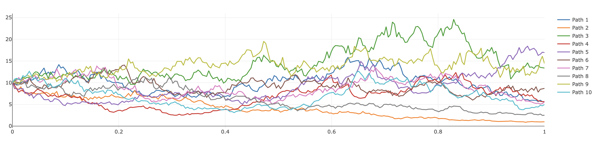

# `stochastics`

Many stochastic processes can be generated:

```rust,noplayground
{{#include ../../../examples/examples/stochastic_processes.rs:stochastic_processes}}
```

Paths can be plotted via the `plot_vector!` macro or `plotly`:

